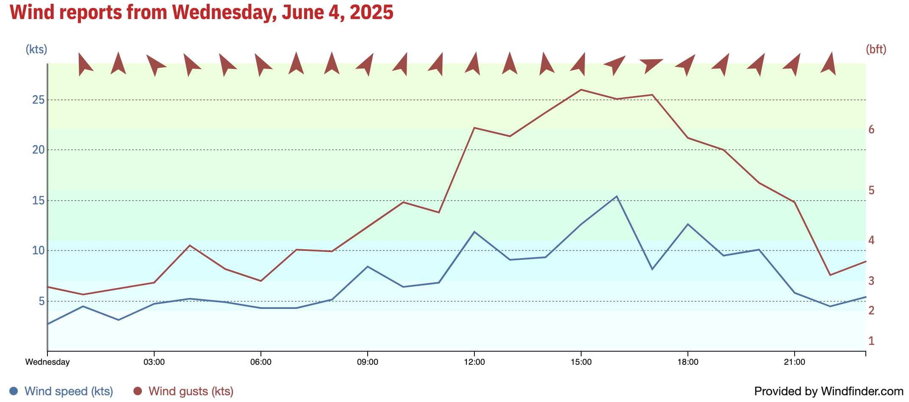
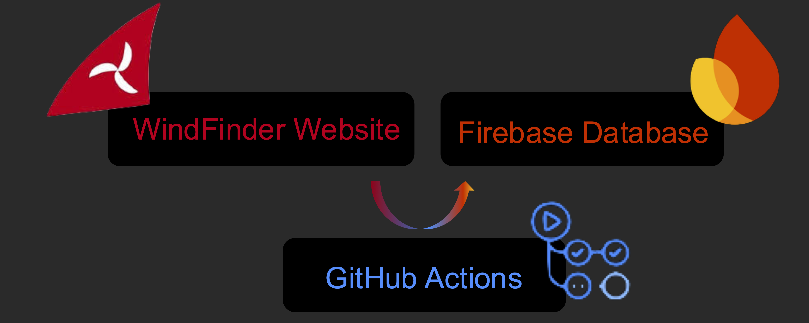

# Wind Data Collector


A Python-based web scraper that automatically collects wind data from [Windfinder](https://www.windfinder.com/forecast/wannsee) and stores it in a [Firebase](https://firebase.google.com/) Firestore database. The project runs daily using GitHub Actions to maintain a continuous historical record of wind conditions at Wannsee, Berlin.

**🔗 Repository**: https://github.com/loresalm/WhereIsMyWind.git

## Project Motivation

This project serves as a **complete example of building a scheduled scraper with database storage entirely for free**, without requiring any personal hosting infrastructure. It demonstrates how to:

- Create an automated data collection pipeline using only free services
- Leverage GitHub Actions as a serverless cron job scheduler
- Use Firebase's free tier for database storage
- Build a production-ready scraper that runs 24/7 without maintenance

Perfect for developers learning web scraping, automation, or anyone needing to collect data regularly without the overhead of managing servers or paying for hosting services.

## Features

- **Automated Data Collection**: Scrapes wind data from Windfinder API daily
- **Firebase Integration**: Stores data in Firestore for easy access and querying
- **GitHub Actions Automation**: Runs automatically every day at 6:00 AM UTC
- **Data Transformation**: Converts raw API data into a structured format
- **Error Handling**: Comprehensive logging and exception handling
- **Manual Triggering**: Supports manual workflow execution when needed

## Data Collected



The scraper collects the following wind data points for each minute of the previous day:

- **Time**: Timestamp in HH:MM format
- **Wind Direction**: Direction in degrees (e.g., "245°")
- **Wind Speed**: Speed in knots
- **Wind Gusts**: Gust speed in knots
- **Temperature**: Air temperature

## Project Structure



```
├── scraper.py              # Main scraping script
├── .github/
│   └── workflows/
│       └── scrape.yml      # GitHub Actions workflow
├── .secrets/               # Firebase credentials (created at runtime)
│   └── serviceAccountKey.json
└── README.md              # This file
```

## Setup Instructions

### Prerequisites

- Python 3.10+
- Firebase project with Firestore enabled
- GitHub repository with Actions enabled

### Local Development Setup

1. **Clone the repository**
   ```bash
   git clone https://github.com/loresalm/WhereIsMyWind.git
   cd wind-data-collector
   ```

2. **Install dependencies**
   ```bash
   pip install requests firebase-admin python-dotenv
   ```

3. **Set up Firebase credentials**
   - Create a Firebase service account key
   - Download the JSON credentials file
   - Place it as `.secrets/serviceAccountKey.json`

4. **Run the scraper**
   ```bash
   python scraper.py
   ```

### GitHub Actions Setup

1. **Add Firebase credentials to GitHub Secrets**
   - Go to your repository settings
   - Navigate to Secrets and Variables > Actions
   - Add a new secret named `FIREBASE_CREDENTIALS`
   - Paste the entire content of your Firebase service account JSON file

2. **Enable GitHub Actions**
   - The workflow is configured to run automatically at 6:00 AM UTC
   - You can also trigger it manually from the Actions tab

## Configuration

### API Configuration

The scraper is currently configured for:
- **Location**: Wannsee, Berlin (spot ID: de575)
- **Data Frequency**: 1-minute intervals
- **Collection Time**: Previous day's data

### Firestore Structure

Data is stored in the `wind_data` collection with documents structured as:

```json
{
  "location": "wannsee",
  "date": "2025-06-04",
  "records": [
    {
      "Time": "00:00",
      "Wind Direction": "245°",
      "Wind Speed (kts)": 12,
      "Wind Gusts (kts)": 15,
      "Temperature": 18
    }
  ],
  "timestamp": "2025-06-05T06:00:00Z",
  "source": "API"
}
```

## How It Works

1. **Token Retrieval**: Dynamically extracts API authentication token from Windfinder's website
2. **Data Fetching**: Makes authenticated API requests to retrieve wind data
3. **Data Transformation**: Converts raw API response into structured format
4. **Storage**: Saves processed data to Firebase Firestore
5. **Logging**: Comprehensive logging throughout the process

## Scheduling

The GitHub Actions workflow runs:
- **Daily**: Every day at 6:00 AM UTC
- **Manual**: Can be triggered manually from the GitHub Actions interface

## Error Handling

The scraper includes robust error handling for:
- API request failures
- Firebase connection issues
- Data parsing errors
- Missing or invalid credentials
- Network timeouts

## Security

- Firebase credentials are stored as encrypted GitHub Secrets
- Sensitive files are automatically cleaned up after each run
- No credentials are logged or exposed in the output

## Monitoring

Check the GitHub Actions logs to monitor:
- Daily execution status
- Data collection statistics
- Any errors or warnings
- Firebase write operations

## Customization

### Changing Location

To scrape data for a different location:
1. Update the `API_BASE_URL` with the new spot ID
2. Modify the `LOCATION` constant
3. Update the token retrieval URL in `get_token()`

### Adjusting Schedule

Modify the cron expression in `.github/workflows/scrape.yml`:
```yaml
schedule:
  - cron: '0 6 * * *'  # Current: 6:00 AM UTC daily
```

### Data Retention

The current setup stores all historical data. Consider implementing data retention policies in Firestore if storage becomes a concern.

## Troubleshooting

### Common Issues

1. **API Token Expiration**: The scraper automatically retrieves fresh tokens
2. **Firebase Connection**: Verify credentials are correctly set in GitHub Secrets
3. **Missing Data**: Check Windfinder API availability and rate limits
4. **Workflow Failures**: Review GitHub Actions logs for detailed error messages

### Debugging

Enable debug logging by modifying the logging level in `scraper.py`:
```python
logging.basicConfig(level=logging.DEBUG)
```

## Contributing

1. Fork the repository
2. Create a feature branch
3. Make your changes
4. Test thoroughly
5. Submit a pull request

## License

This project is for educational and personal use. Please respect Windfinder's terms of service when using their data.

## Acknowledgments

- Windfinder for providing wind data
- Firebase for database services
- GitHub Actions for automation platform